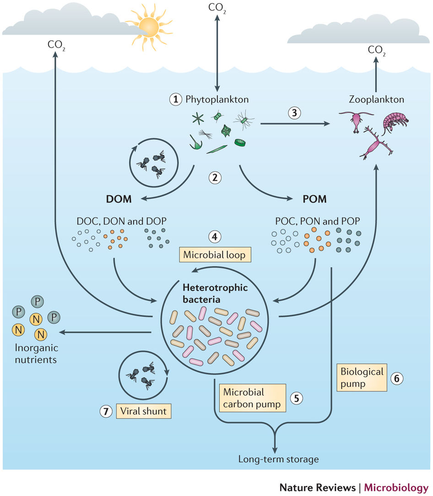
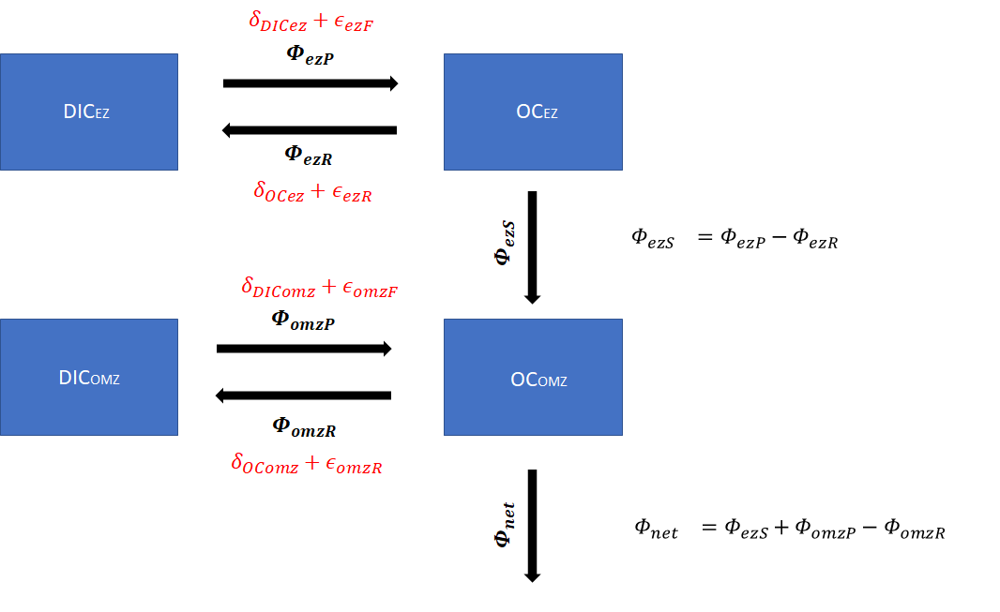
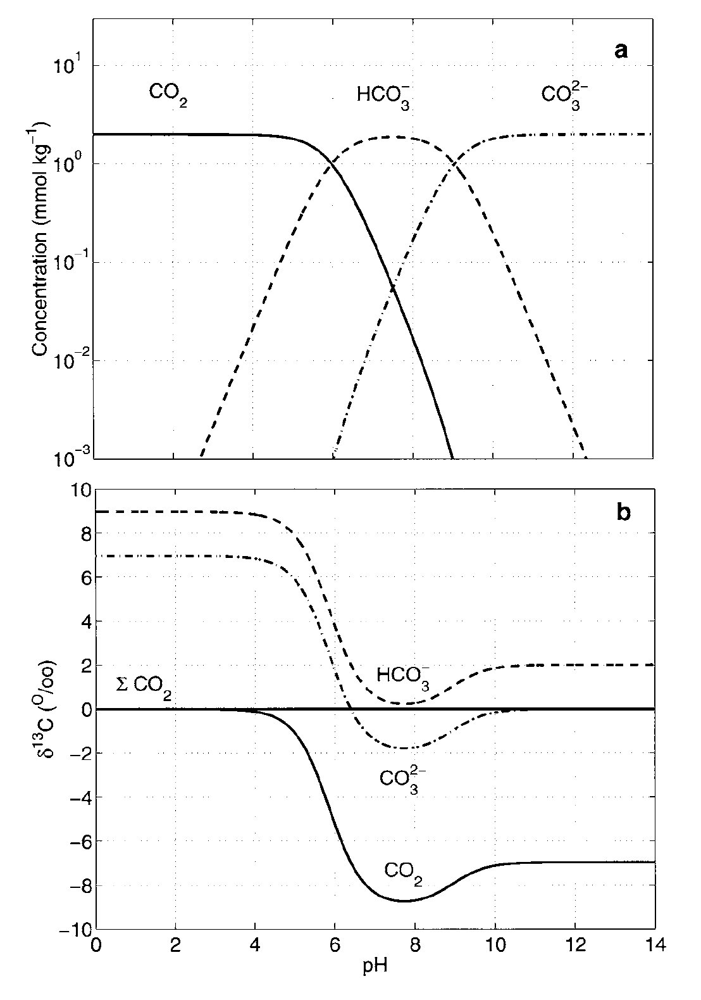

```{r "load packages", include=FALSE}
library(tidyverse)
```


# Microbial Loop Figure


```{r out.width = "100%", echo=FALSE, eval=TRUE}

#From Buchan et al., 2014 (https://www.nature.com/articles/nrmicro3326.pdf)
```


# Microbial Pump Model

```{r out.width = "100%", echo=FALSE, eval=TRUE}
 
```


## Parameters


$$
\begin{aligned}
r_e &= \frac{\Phi_{ezR}}{\Phi_{ezP}} \\
r_o &= \frac{\Phi_{omzR}}{\Phi_{omzP}} \\
f_{omz} &= \frac{\Phi_{omzP}}{\Phi_{omzP}+\Phi_{ezP}} \\
f_{onet} &= \frac{\Phi_{omzP}-\Phi_{omzR}}{\Phi_{omzP}-\Phi_{omzR}+\Phi_{ezP}-\Phi_{ezR}} \\
\end{aligned}
$$


## Fluxes


$$
\begin{aligned}
\Phi_{net} &= \Phi_{ezS} + \Phi_{omzP} - \Phi_{omzR} \\
\Phi_{ezS} &= \frac{(1-r_e)(1-f_{omz})}{{f_{omz}(r_e-r_o)+1-r_e}}*\Phi_{net} \\
\Phi_{ezP} &= \frac{(1-f_{omz})}{f_{omz}(r_e-r_o)+1-r_e}*\Phi_{net} \\
\Phi_{ezR} &= r_e\Phi_{ezP} \\
\Phi_{omzP} &= \frac{f_{omzP}}{f_{omz}(r_e-r_o)+1-r_e}*\Phi_{net} \\
\Phi_{omzR} &= r_o\Phi_{omzP}
\end{aligned}
$$


## Isotope Fluxes


$$
\begin{aligned}
\delta_{OCez} &= \delta_{DICez}+ \epsilon_{ezF} - r_e\epsilon_{ezR} \\
\delta_{OComz} &= \frac{[(f_{omz}-1)(r_e-1)\delta_{DICez}+(r_e-1)(r_e\epsilon_{ezR}-\epsilon_{ezF})+f_{omz}(\delta_{DIComz} +\epsilon_{omzF}-r_o\epsilon_{omzR}+(r_e-1)(\epsilon_{ezF}-r_e\epsilon_{ezR}))]}{1+(f_{omz}-1)r_e} \\
f_{omz} &= \frac{(r_e-1)(\delta_{OComz}+r_e\epsilon_{ezR}-\delta_{DICez}-\epsilon_{ezF})}{(1-r_e)\delta_{DICez}+r_e(\delta_{OComz}-\epsilon_{ezF}+(r_e-1)\epsilon_{ezR})+\epsilon_{ezF}+r_o\epsilon_{omzR}-\delta_{DIComz}-\epsilon_{omzF}} \\
f_{onet} &= \frac{(r_o - 1) (\delta_{DICez} - r_e\epsilon_{ezR} + \epsilon_{ezF} - \delta_{OComz})}{(r_o - 1)\delta_{DICez} + \delta_{DIComz} - \epsilon_{ezF} + r_e\epsilon_{ezR}+\epsilon_{omzF} - r_o(\delta_{OComz}-\epsilon_{ezF}+r_e\epsilon_{ezR}+\epsilon_{omzR})}
\end{aligned}
$$


## Euphotic Zone Node

Let's consider the sensitivity of the system to the relative rates of production and remineralization in the euphotic zone, in addition to variability in dissolved inorganic pools. How does the isotopic composition of organic carbon change in the euphotic zone, under varying rates of remineralization? We will use generalized fractionation factors for carbon fixation and respiration.


```{r}
ez_node <- expand.grid(
  eps_ez_fix = -20,
  eps_ez_resp = c(0,2),
  r_ez = c(0,.5,1),
  dic_ez = seq(0,-8, -1)
) %>% 
  as_data_frame() %>% 
  mutate(OCez = dic_ez+eps_ez_fix-r_ez*eps_ez_resp)
  

ez_plot <- 
  ggplot(ez_node) +
  aes(x = dic_ez, y = OCez, color = factor(r_ez), linetype = factor(eps_ez_resp)) +
  geom_line() + 
  scale_x_continuous(name = latex2exp::TeX("$DIC_{ez}$")) +
  scale_y_continuous(name = latex2exp::TeX("$\\delta^{13}OC_{ez}$")) +
  scale_color_manual(name = "EZ Remineralization", 
                     values = RColorBrewer::brewer.pal(6, "Dark2")) +
  scale_linetype_manual(name = latex2exp::TeX("$\\epsilon_{ezR}$"),
                     values = 1:5) +
  theme_gray()

ez_plot


```


### How does the role of remineralization compare to that of the DIC pool being incorporated into the cell in the euphotic zone? 

The direct fractionation of respiration on the isotopic composition of particulate organic carbon is very small even over large ranges of relative remineralization rates (0 to 1). However, the form of inorganic carbon incorporated into the cell as a considerably larger fractionation effect.


### What might play a role in the availability of different inorganic carbon species throughout the water column?

The pH of the oceans dictates the relative concentrations of inorganic carbon species, however the offset in isotopic composition remains the same (~8 per mille between CO2 and HCO3). A shifting pH and/or high respiration rates could significantly change the the local concentrations of each species and have significant isotopic effects on biomass production.


```{r out.width = "100%", echo=FALSE, eval=TRUE}
 
```


## OMZ Node


### Let's solve for the isotopic composition of OC in the OMZ. Assume that the fractionation factors for respiration are the same in the euphotic zone and the OMZ, but let's try a range of CO2 fixation factors found in the literature from different fixation pathways. We'll also go ahead and assign values to the different DIC pools between the EZ and OMZ.


```{r}
# Now hold remineralization constant, and change the fractionation factors between euphotic vs omz fixation

omz_node <- expand.grid(
  eps_omz_resp = 2,
  eps_ez_resp = 2,
  r_ez = .9,
  r_omz = .9,
  f_omz = seq(0,1,.01),
  eps_omz_fix = c(-20, -26, -36),
  eps_ez_fix = -20,
  dic_low = -8,
  dic_high = 0
) %>% 
  mutate(OC_omz = ((f_omz-1)*(r_ez-1)*dic_high+(r_ez-1)*(r_ez*eps_ez_resp-eps_ez_fix)+f_omz*(dic_low+eps_omz_fix-r_omz*eps_omz_resp+(r_ez-1)*(eps_ez_fix-r_ez*eps_ez_resp)))/(1+(f_omz-1)*r_ez))


base_plot <- 
  ggplot(omz_node) +
  aes(x = f_omz, y = OC_omz, color = factor(eps_omz_fix), linetype = factor(r_ez)) +
  geom_line() + 
  scale_x_continuous(name = latex2exp::TeX("$f_{omz}$"), 
                     expand = c(0,0), labels = function(x) paste(100*x, "%")) +
  scale_y_continuous(name = latex2exp::TeX("$\\delta^{13}OC_{omz}$")) +
  scale_color_manual(name = latex2exp::TeX("$\\epsilon_{omzF}$"), 
                     values = RColorBrewer::brewer.pal(6, "Dark2")) +
  scale_linetype_manual(name = "EZ Remineralization", 
                     labels = function(x) paste0(100*as.numeric(x), "%"),
                     values = 1:5) +
  expand_limits(y = -15) +
  theme_gray()

base_plot
```


### Why does the isotopic composition in the OMZ have a maximum value of -22 regardless of Eps OMZ Fixation?

At 0% fomz, all of the biomass is produced in the surface, so the only relevant fractionations are due to fixation in the surface, respiration.


### At EPS OMZ Fix = -20, the isotopic composition still changes despite being the same fractionation as at the surface, why?

Despite utilizing the same CO2 fixation pathway in this scenario, the DIC pools they draw from are 8 per mille different.


### Why does the POC become more depleted with a larger fomz component?

The greater fraction of POC produced via fixation pathways with a larger fractionation factor.


### Now let's experiment with varying remineralization terms. Start first with a range of euphotic zone remineralization to determine how the OC in the OMZ would be affected.

```{r}
omz_node2 <- expand.grid(
  dic_high = 0,
  dic_low = -8,
  r_ez = c(.1,.5, .95),
  r_omz = .9,
  f_omz = seq(0,1,.01),
  eps_omz_fix = c(-20, -26, -36),
  eps_ez_fix = -20
) %>% 
  mutate(OC_omz = ((f_omz-1)*(r_ez-1)*dic_high+(r_ez-1)*(r_ez*eps_ez_resp-eps_ez_fix)+f_omz*(dic_low+eps_omz_fix-r_omz*eps_omz_resp+(r_ez-1)*(eps_ez_fix-r_ez*eps_ez_resp)))/(1+(f_omz-1)*r_ez))


base_plot %+% omz_node2
```


### What do you notice about the difference in slope between different remineralization scenarios?

The isotopic composition changes much more rapidly under scenarios with higher EZ remineralization because less of the isotopically light OMZ POC is required to significantly alter the bulk isotopic value.


## Now let's experiment with the role of remineralization in the OMZ on the OC isotopic composition.

```{r}
omz_node3 <- expand.grid(
  r_ez = .9,
  r_omz = c(.1,.5,.99),
  f_omz = seq(0,1,.01),
  eps_omz_fix = c(-20, -26, -36),
  eps_ez_fix = -20
) %>% 
  mutate(OC_omz = ((f_omz-1)*(r_ez-1)*dic_high+(r_ez-1)*(r_ez*eps_ez_resp-eps_ez_fix)+f_omz*(dic_low+eps_omz_fix-r_omz*eps_omz_resp+(r_ez-1)*(eps_ez_fix-r_ez*eps_ez_resp)))/(1+(f_omz-1)*r_ez))

base_plot2 <- 
  ggplot(omz_node3) +
  aes(x = f_omz, y = OC_omz, color = factor(eps_omz_fix), linetype = factor(r_omz)) +
  geom_line() + 
  scale_x_continuous(name = latex2exp::TeX("$f_{omz}$"), 
                     expand = c(0,0), labels = function(x) paste(100*x, "%")) +
  scale_y_continuous(name = latex2exp::TeX("$\\delta^{13}OC_{omz}$")) +
  scale_color_manual(name = latex2exp::TeX("$\\epsilon_{omzF}$"), 
                     values = RColorBrewer::brewer.pal(6, "Dark2")) +
  scale_linetype_manual(name = "OMZ Remineralization", 
                     labels = function(x) paste0(100*as.numeric(x), "%"),
                     values = 1:5) +
  expand_limits(y = -15) +
  theme_gray()

base_plot2
```


### How does this compare to the relationship with EZ Remineralization?

Similarly, the remineralization rapidly changes the isotopic composition of the POC when the fixation pathways are significantly different from that at the surface (-26, or -36). Again as the fraction of OMZ production increases, the POC values become more depleted and approach 100% OMZ biomass.


## The f_onet term is a means to relate the different isotopic composition of the EZ and OMZ in order to estimate what percentage of the POC found below the OMZ was actually produced in the OMZ. First let's see how this term relates to the f_omz term described above.

```{r}
omz_node4 <- expand.grid(
  r_ez = c(.01,.5, .99),
  r_omz = .9,
  f_omz = seq(0,1,.05)
) %>% 
  mutate(f_onet = f_omz*(r_omz-1)/(-1-(f_omz-1)*r_ez+f_omz*r_omz))

sanity_check <- 
  ggplot(omz_node4) +
  aes(x = f_omz, y = f_onet, color = factor(r_ez)) +
  geom_point() + 
  #geom_hline(yintercept = -10, color = "black", linetype = 2) +
  scale_x_continuous(name = latex2exp::TeX("$f_{omz}$"), 
                     expand = c(0,0), labels = function(x) paste(100*x, "%")) +
  scale_y_continuous(name = latex2exp::TeX("$f_{onet}$")) +
  scale_color_manual(name = "EZ Remineralization", labels = function(x) paste0(100*as.numeric(x), "%"), 
                     values = RColorBrewer::brewer.pal(6, "Dark2")) +
  #expand_limits(y = -15) +
  theme_gray()

sanity_check
```


### Does this make sense?! Which scenarios require a much greater fraction of OMZ production in order to achieve a significant f_onet?

Under high EZ remineralization, relatively little gross production in the OMZ (f_omz) is needed to achieve a significant f_onet, while when EZ Remin is low, a much larger fraction of production is required to make up a significant amount of the exported fraction.


### Let's consider the opposite scenario, keep r_ez constant but select a range of r_omz values

```{r}
omz_node5 <- expand.grid(
  r_ez = .9,
  r_omz = c(.01,.5, .99),
  f_omz = seq(0,1,.05)
) %>% 
  mutate(f_onet = f_omz*(r_omz-1)/(-1-(f_omz-1)*r_ez+f_omz*r_omz))

sanity_check2 <- 
  ggplot(omz_node5) +
  aes(x = f_omz, y = f_onet, color = factor(r_omz)) +
  geom_point() + 
  #geom_hline(yintercept = -10, color = "black", linetype = 2) +
  scale_x_continuous(name = latex2exp::TeX("$f_{omz}$"), 
                     expand = c(0,0), labels = function(x) paste(100*x, "%")) +
  scale_y_continuous(name = latex2exp::TeX("$f_{onet}$")) +
  scale_color_manual(name = "OMZ Remineralization", labels = function(x) paste0(100*as.numeric(x), "%"), 
                     values = RColorBrewer::brewer.pal(6, "Dark2"))
  theme_gray()

sanity_check2
```


### Does it STILL make sense!? Which scenario requires a much greater fraction of OMZ production in order to achieve a significant f_onet?

The high OMZ remineralization scenario!


## Now let's play with a theoretical water column with realistic values for POC, remineralization etc. and a range of CO2 fixation fractionation factors.

```{r}
omz_node6 <- expand.grid(
  eps_ez_resp = 2,
  eps_omz_resp = 2,
  delta_oc_omz = -30,
  delta_oc_ez = -22,
  delta_dic_ez = 0,
  delta_dic_omz = -10,
  r_ez = .9,
  r_omz = seq(.75, 1,.01),
  eps_omz_fix = c(-20,-26, -36),
  eps_ez_fix = -20
) %>% 
  mutate(f_onet = (r_omz-1)*(delta_dic_ez-delta_oc_omz+eps_ez_fix-r_ez*eps_ez_resp)/((r_omz-1)*delta_dic_ez + delta_dic_omz-eps_ez_fix+r_ez*eps_ez_resp+eps_omz_fix-r_omz*(delta_oc_omz-eps_ez_fix+r_ez*eps_ez_resp+eps_omz_resp)))


base_plot3 <- 
  ggplot(omz_node6) +
  aes(x = r_omz, y = f_onet, color = factor(eps_omz_fix), linetype = factor(r_ez)) +
  geom_line() + 
  #geom_hline(yintercept = -10, color = "black", linetype = 2) +
  scale_x_continuous(name = latex2exp::TeX("$r_{omz}$"), 
                     expand = c(0,0), labels = function(x) paste(100*x, "%")) +
  scale_y_continuous(name = latex2exp::TeX("$f_{onet}$")) +
  scale_color_manual(name = "Eps OMZ Fixation", 
                     values = RColorBrewer::brewer.pal(6, "Dark2")) +
  scale_linetype_manual(name = "EZ Remineralization", 
                     labels = function(x) paste0(100*as.numeric(x), "%"),
                     values = 1:5) +
  #expand_limits(y = -15) +
  theme_gray()

base_plot3
```


### Why doesn't the EZ remineralization appear to significantly change the fonet component in this plot?

Respiration is defined as having a very small isotopic effect, rather it plays a much more important role in the proportion of biomass produced in the surface that makes it to the OMZ and deeper. Also, the availability of remineralized CO2 is likely responsible for the large shift in the isotopic composition of the dissolved inorganic pools at different points in the water column.


### Considering that remineralization in the OMZ is also likely >85%, what range of fonet values do we estimate based on these theoretical measurements?

Approximately 5-30% depending on the omz fixation value, seems unlikely however that the myriad of metabolisms in the OMZ would have the same average fractionation factor as the EZ.


```{r}
omz_node6 <- expand.grid(
  eps_ez_resp = 2,
  eps_omz_resp = 2,
  delta_oc_omz = -30,
  delta_oc_ez = -22,
  delta_dic_ez = 0,
  delta_dic_omz = -10,
  r_ez = .9,
  r_omz = seq(.75, 1,.01),
  eps_omz_fix = c(-20,-26, -36),
  eps_ez_fix = -20
) %>% 
  mutate(f_onet = (r_omz-1)*(delta_dic_ez-delta_oc_omz+eps_ez_fix-r_ez*eps_ez_resp)/((r_omz-1)*delta_dic_ez + delta_dic_omz-eps_ez_fix+r_ez*eps_ez_resp+eps_omz_fix-r_omz*(delta_oc_omz-eps_ez_fix+r_ez*eps_ez_resp+eps_omz_resp)))


base_plot3 <- 
  ggplot(omz_node6) +
  aes(x = r_omz, y = f_onet, color = factor(eps_omz_fix), linetype = factor(r_ez)) +
  geom_line() + 
  #geom_hline(yintercept = -10, color = "black", linetype = 2) +
  scale_x_continuous(name = latex2exp::TeX("$r_{omz}$"), 
                     expand = c(0,0), labels = function(x) paste(100*x, "%")) +
  scale_y_continuous(name = latex2exp::TeX("$f_{onet}$")) +
  scale_color_manual(name = "Eps OMZ Fixation", 
                     values = RColorBrewer::brewer.pal(6, "Dark2")) +
  scale_linetype_manual(name = "EZ Remineralization", 
                     labels = function(x) paste0(100*as.numeric(x), "%"),
                     values = 1:5) +
  #expand_limits(y = -15) +
  theme_gray()

base_plot3
```
```


